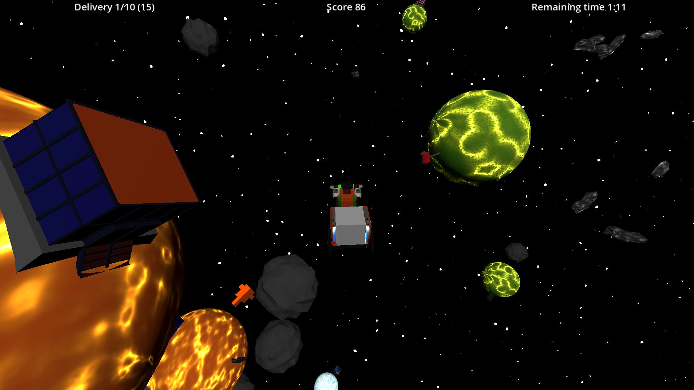
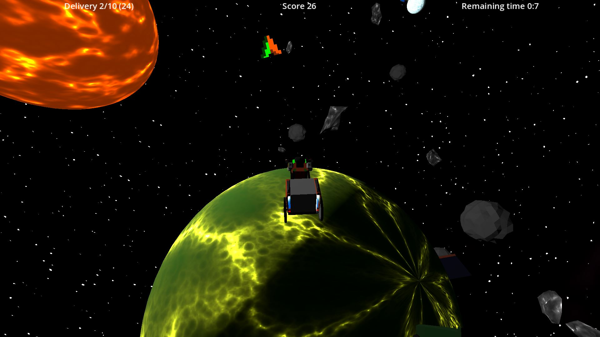
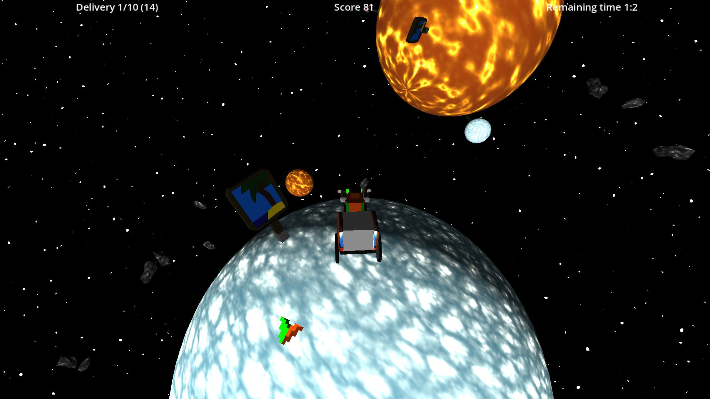

# Description

Hubert Roboto needs to deliver packages on time or it will lose its jobs.
Help it deliver package with its awesome rickshaw in a very crowdy and bouncy space.

Made for LD53

# Controls

| Key | Action |
| --- | --- |
| W/S | Forward/Backward |
| Q/D | Left/Right |
| SHIFT | Nose up |
| CTRL | Nose down |
| Space | Boost OR Jump out of gravity |

# Credits

 * Godot : Game engine
 * Gimp : Texture edition software
 * Blender : 3D model edition software
 * Ableton : Music composition software
 * TODO : Base of sound effects

# Links

 * https://ldjam.com/events/ludum-dare/53/huberts-space-rickshaw
 * https://squirrelsoft.itch.io/ld53-huberts-space-rickshaw
